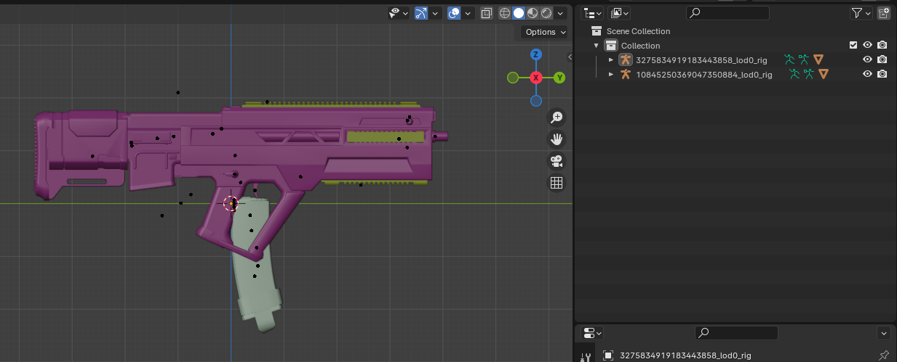
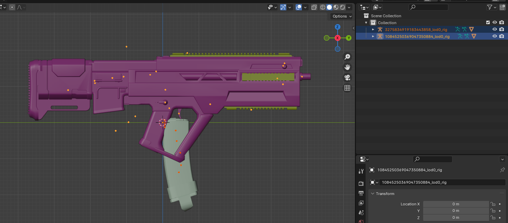
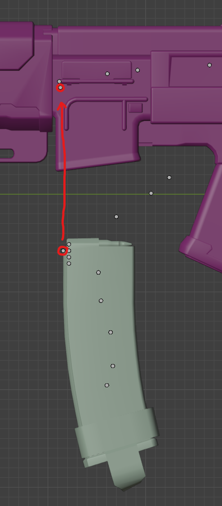
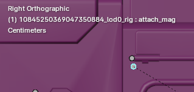
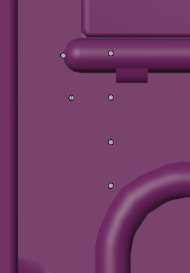
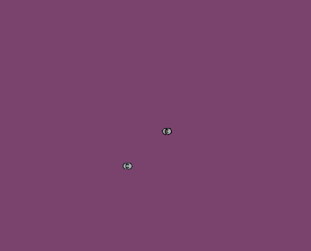
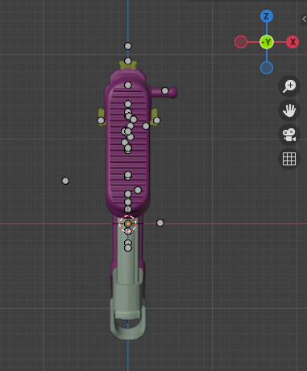
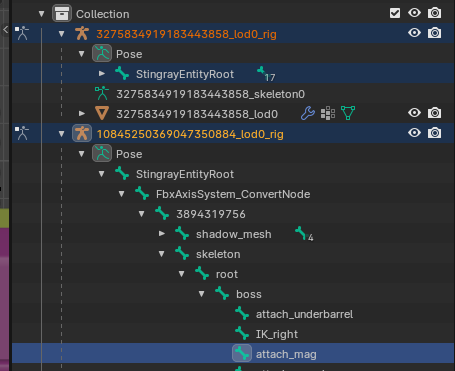
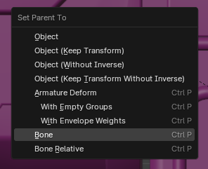
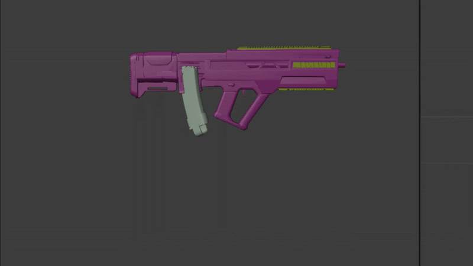

# Aligning Magazines

For messing around with animations for weapons, you more than likely want to see where the magazine for your weapon is. Since weapons in Helldivers 2 can have different magazines, the weapon and the magazine are two separate rigs.

This means we have to combine them in a really weird way to get things lined up properly, and we can’t use the SDK’s built-in armature merging as that currently doesn’t support attaching rigs to any bones other than the StingrayEntityRoot bone.

For weapons specifically, the StingrayEntityRoot of the magazine needs to be aligned and then parented to the attach_mag of the weapon armature. 

Here’s how you do that:

1. Load both weapon and magazine, making sure to merge armatures off either in the settings or that you don’t have the rig selected when you import the other unit. You should see two separate armatures in the scene, one for the weapon and one for the mag.

2. Select both armatures.

3. Switch to pose mode. It is recommended that you go into the X view so you’re viewing it from a perfectly flat angle.

4. Select the `StingrayEntityRoot` bone on the mag armature and move it so it is in the same place as the `attach_mag` bone on the gun.

If you are having trouble figuring out which bone is which, when selecting it, you will see the name of the bone in pose mode in the top left of your Blender window.

You’re going to zoom in as much as possible to make sure they are properly aligned.

With max zoom, you can see they are not aligned.

You may also want to switch to the Y view to make sure it’s aligned correctly, looking from behind.

5. CTRL-click the `attach_mag` bone on the gun so you now have the `StingrayEntityRoot` on the mag and the `attach_mag` on the gun selected. It might be easier to unfold the bones in the hierarchy and find them. Make sure you select the magazine’s `StingrayEntityRoot` first and then the attach_mag of the weapon.

6. Parent the bone with `CTRL-P > Bone`.

### Now you can preview animations with your magazine!

