# Other Games' Animations

If you have animations from other games that you want to import into Helldivers 2, you will need to retarget the animations from the other game’s skeleton to your Helldiver skeleton.

Make sure you have the Bone [Animation Copy Tool](https://github.com/Boxofbiscuits97/blender_BoneAnimCopy) installed.

You will also need the rig and animations from whatever other game you want to rip the animations from. Make sure the other rig is loaded up in Blender and the animations are working.

::: info NOTE
You will also need to set up your Helldivers rig as depicted in the [Getting Started](./overview) section.
:::

## Setup

1. Align your rigs so they are about the same size. You do not need to make the pose of anything perfect, as the animation retargeting will fix any slight offsets, such as the arms not being aligned properly.
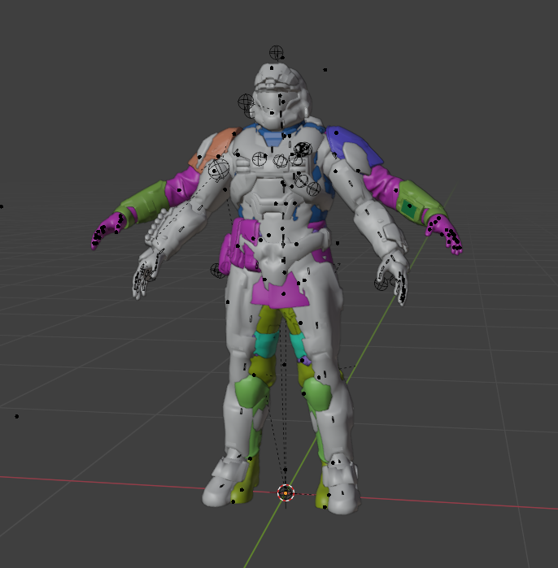

2. In the Bone Animation Copy Tool, set the Map Skeleton to your Helldivers rig and the Constraint Skeleton to your other rig.
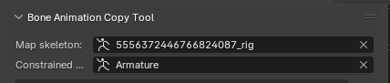

3. Now you have to add entries to the list and assign bones between the two rigs. Here’s a completed list of all of the bones you’d need (Besides the fingers), with the Helldiver bones being listed on the left side.
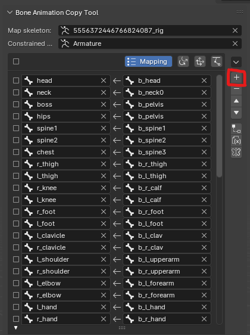

You can see that your custom rig may have some similar names, but they are likely not going to be the same.

When previewing your animation, your Helldiver may be completely at the wrong position, but the rotations should be correct.
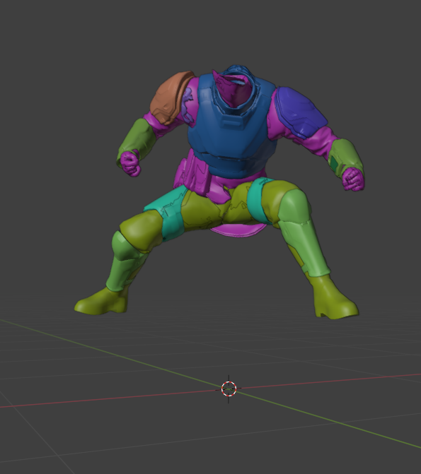

4. You will need to go to the location tab and then enable location for all of the bones except for the hands and fingers.
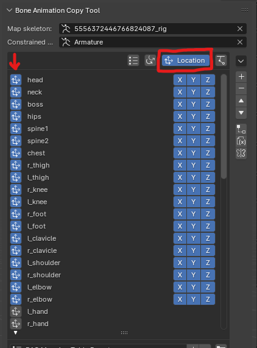

Enabling location matching for the hands and fingers will more often than not break the finger animations, so we are going to enable all of the other bones by pressing the button on the left of the bone name.

6. Your rigs should now be aligned properly.
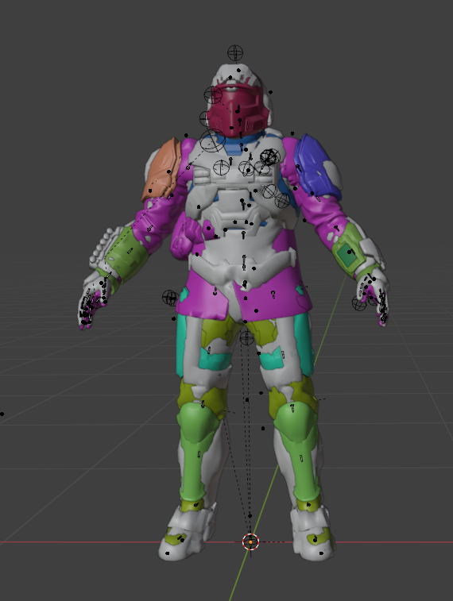

Playing the animation on the other rig, the Helldiver rig should follow it. You can now also hide your other rig to see the Helldiver rig better.
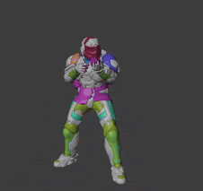

## Baking Animations

1. Then you can bake the animation.
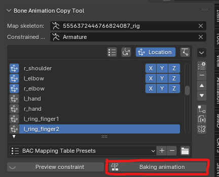

2. The baked animation will now be created on your Helldiver rig, but its name is not a proper ID. Change it to the ID of the animation you want it to replace. 
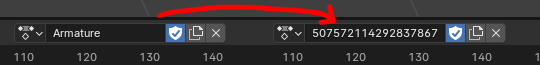

::: info NOTE
I’ll just be changing it to the salute emote for ease. ID: `507572114292837867`
:::

3. Depending on whether the position of Bones changes in your animation, you will want to enable the `Save Bone Positions` setting in your settings. (This may result in some issues with additive animations in-game, so be aware.)
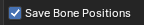

4. Now that your animation has the proper ID set. To save an animation. **GO BACK TO OBJECT MODE** and select the rig object. `Right Click > Save Animation`.
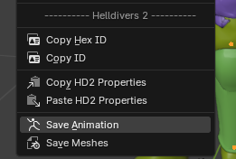

### And now your custom animation is in the game!
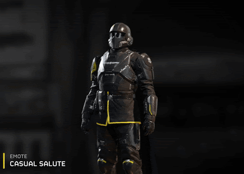
