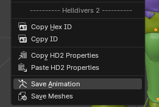

# Getting Started

To get started modifying animations using the SDK, we need to set up a few things first.

## Quickstart

1. Go to the Animation tab at the top of Blender.

2. In the timeline window at the bottom of your window, change the timeline type to the `Action Editor`.

3. **IF** you are modifying player animations, **YOU MUST IMPORT THE PLAYER AVATAR, NOT THE ARMOR PIECES**. The player avatar can be found in the Super Destroyer Interior 2 archive with ID: `5556372446766824087` (content/fac_helldivers/cha_avatar/avatar_helldiver)

::: danger IMPORTANT
All player animations are inside the Super Destroyer Interior 2 Archive. You will want to fold all of the sections up, or else Blender will become very laggy.
:::

4. Now you can find the Animations you want to modify and import them. You can find the documented animation IDs in the [Archive Spreadsheet](https://docs.google.com/spreadsheets/d/1oQys_OI5DWou4GeRE3mW56j7BIi4M7KftBIPAl1ULFw/edit?gid=1543625930#gid=1543625930).

::: info
For this example, We’ll be importing the salute animation. ID: `507572114292837867`
:::

5. With the Animation found and the rig selected, import the animation.

You should see it starting to play and loop immediately.

6. Now, with any bones selected while in pose mode, you will see their key frames at the bottom. Let’s just select and look at the head bone.

### Now you can begin animating!

## Other Important Information

### Recording Animations
If you are modifying Keyframes, **YOU NEED TO ENABLE RECORDING** or your changes **WILL NOT SAVE**. Make sure this is selected and not grayed out.

### Switching Between Animations
Switching between different animations can be done with the dropdown list.

### Renaming Animations
If you want to rename your animations, **KEEP THE ID** and just put your name after it.

### Saving Bone Positions
Depending on whether the position of Bones changes in your animation, you will want to enable the `Save Bone Positions` setting in your settings. (This may result in some issues with additive animations in-game, so be aware.)

### Saving Animations
To save an animation. **GO BACK TO OBJECT MODE** and select the rig object. `Right Click > Save Animation`. This will save whatever animation is currently selected in the dropdown list of the Action Editor.

