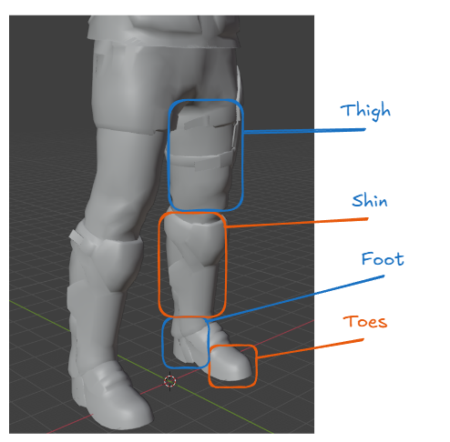
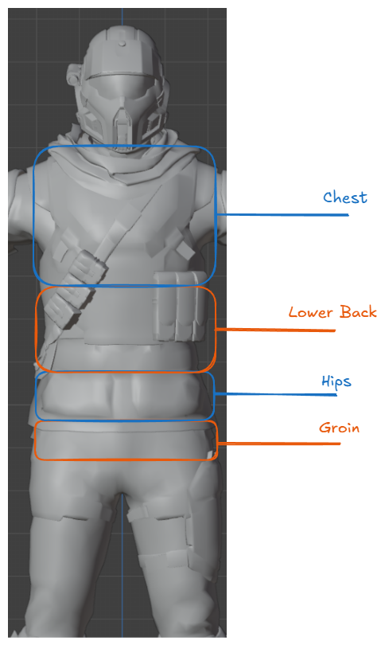
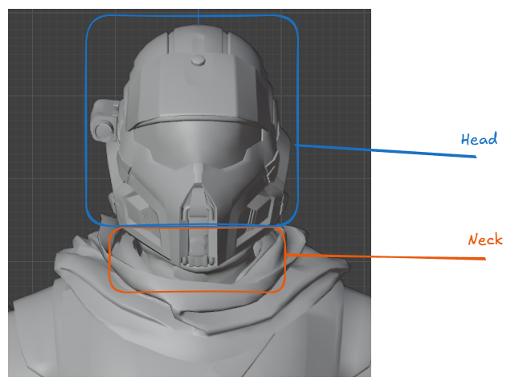
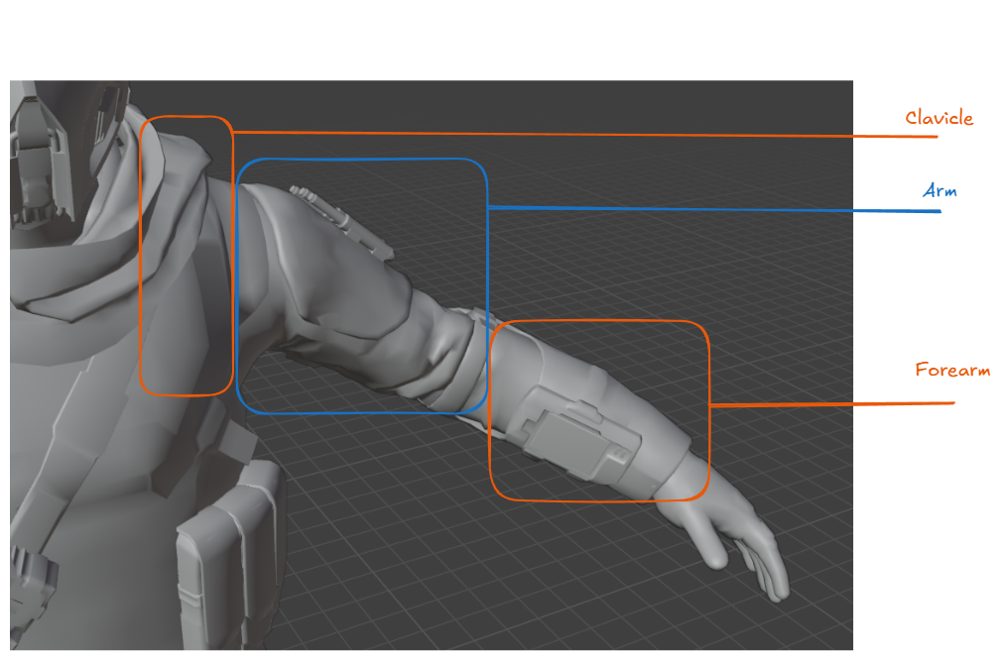
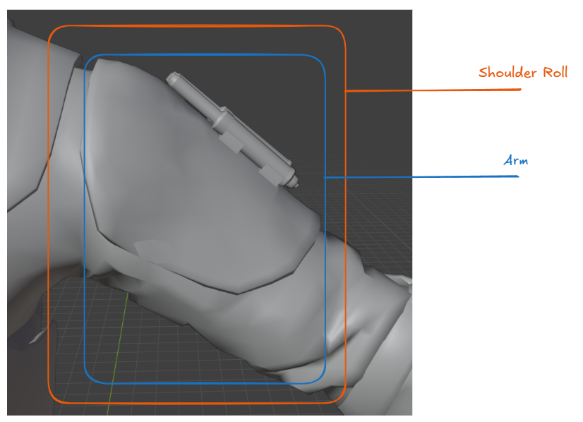
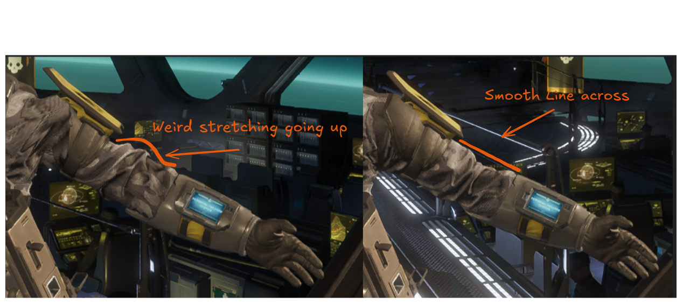
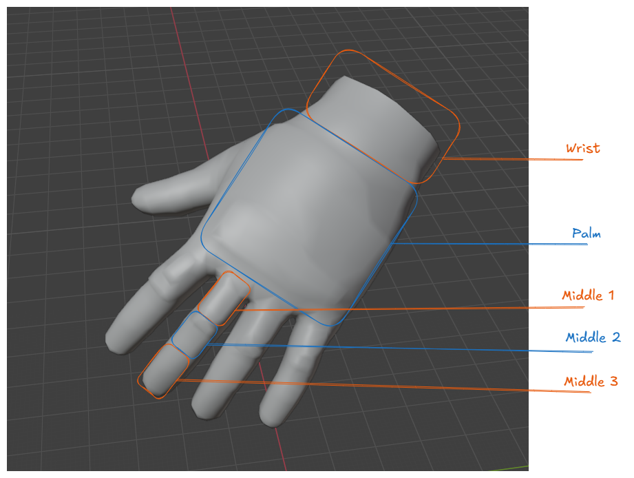

# HD2 Armor Anatomy

Before we start on modding a HD2 armor, let us first understand the system we are working with.

## Armature

Every armor in the game uses the same exact `armature`, so all the bones will be completely the same even if the `vertex groups` are named differently.

The next few pictures will go over the areas each `bone` of the `armature` control.

::: info
Internally, `lower back` is called `spine2`, but for archival purposes we are calling it `lower back`. `Groin` is actually the `root bone` and does not exist as it's own bone on the `armature`.
:::

::: info
Technically speaking, the `neck bone` does exist, however, it is not utilized in the game in any capacity.
:::

::: info
The upper arm can be broken down into two distinct parts, `arm` and `shoulder roll`. Due to how poorly Arrowhead has utilized the `arm` bone, it is always better to `weight paint` the upper arm of your mesh to the `shoulder roll` bone.

Below is a picture of a SR-24 arm weighted in vanilla versus reweighted to `shoulder roll`.
:::

::: info
All fingers will follow the same format. Starting from the `palm` it will always be 1, 2, then 3. The fingers will be `thumb`, `index`, `middle`, `ring`, and `pinky`,
:::