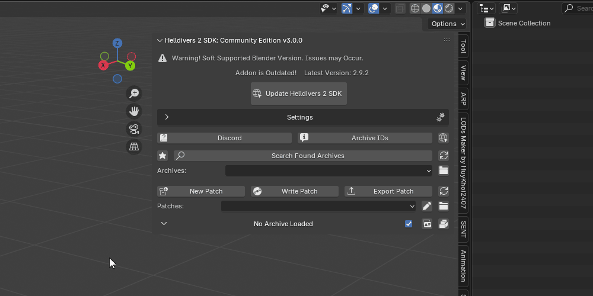
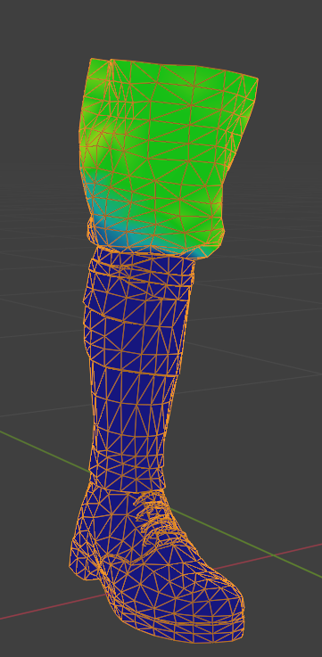
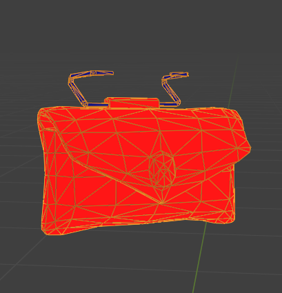

# Armor Replacement

## Setup

Upon launcher Blender and having the SDK installed, you will need to do some basic setup.

    Load the base game archive by clicking the star icon
    Hit New Patch

This will need to be done everytime you open Blender up again.

## Import Unit to Replace

Use the `Search Found Archives` section to search for the archive of the item you wish to mod to add it to the currently loaded archives. If the item cannot be found, use the [spreadsheet](https://docs.google.com/spreadsheets/d/1oQys_OI5DWou4GeRE3mW56j7BIi4M7KftBIPAl1ULFw/edit?usp=sharing).

Helmets and Armors are in two separate archives so you will need to load both of them.

With the archive selected in the SDK, import all the `units` into Blender. These are ArcanePoro's recommended settings for armor imports, but if you wish to retain the gore mesh you can keep that ticked off.

## Posing

Import the model you are going to use to replace the base game armor set. You will now being posing your model to HD2 A-Pose.

::: warning
The model you are using should already have a rig, if it does not, you cannot do this step until you have rigged. This can be done by either rigging said model yourself or by obtaining a model that is already rigged.
:::

<iframe src="https://www.youtube.com/embed/TEPTSrf7ftw" title="Posing" frameborder="0" allowfullscreen></iframe>

## Cutting

At this point it is recommended to duplicate your model so you do not cause any destructive actions that you cannot revert from. This can be done by simply selecting all objects associated with your model and pressing SHIFT+D.

Your model does not need to be cut in the same exact way as the Helldiver model. You cut your model based on the weights.

For example, for the legs you would cut where the thigh weight is 1.0 because the thigh bone is shared between the Helldiver leg part and the Helldiver waist part.

<iframe src="https://www.youtube.com/embed/yZnlUa1iLZ4" title="Cutting" frameborder="0" allowfullscreen></iframe>

In the end, the 6 main parts at minimum that you should have are: 

    Left Arm
    Right Arm
    Torso
    Waist
    Left Leg
    Right Leg

Any other parts are extra and should only be considered if you are modding an armor set that has shared body parts.

### Fixing Cut Seams

After cutting you may notice that your model now has visible seams.

This is usually caused by doing a mesh separation `ALT+P` without first doing a `Mesh > Split by Selection` operation. You can fix this by doing the steps mentioned before, or by doing a data transfer modifier.

Since the `mesh` you are currently cutting is a duplicate of your original `mesh`, you can use the data transfer modifier to reapply mesh normals to your cut body parts.

    Apply Data Transfer modifier to cut body part
    Select original mesh for Source
    Check Face Corner Data
    Select Custom Normals
    Apply
    Repeat for all cut body parts that are suffering from visible seams

There may be some errors on the mesh after this operation, so you may need to separate your mesh into specifically the affected areas where the seam appears only before doing the operation.

## Weight Paint

To have your model move in-game, the model will need to have the proper `vertex groups` applied to the `mesh`. There are two methods that can be used here. 

 Blender's native transfer weights function or use the [Robust Weight Transfer Plugin](https://jinxxy.com/SentFromSpaceVR/robust-weight-transfer), a better alternative to the native function.

Renaming and mixing vertex groups to from the rig your model comes from to fit the Helldivers 2 rig

<iframe src="https://www.youtube.com/embed/02Ts1yNtVOM" title="Weight Paint" frameborder="0" allowfullscreen></iframe>

::: info
Remember to make sure that all your body parts are 1.0 at the seams for the shared bone. It should look like the first picture and not the second picture. Edges for shared bones should only be weighted to a single bone!

:::

Know the difference between a soft body weight and a hard body weight.

<u>Soft Body weights</u> are things that naturally stretch and bend, like cloth or skin. These will usually have a gradient type of weight paint.

<u>Hard Body weights</u> are things like metal or bags on the model that are attached at specific points. These will have a single 1.0 weight paint.

## Materials and Textures

Use the SDK to generate `materials` for your `mesh` to utilize. Please refer to [this](../materials/overview) section on the types of `material` shaders are available to use.

    In the material foldout section hit the 