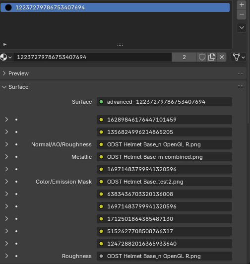
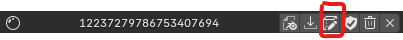
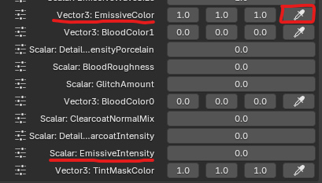

# Advanced

Comes with 3 nodes that will you need to replace.

### Node 3: Normal/AO/Roughness (RGBA)
	R - Normal Map Red channel
	G - Normal Map Green channel
	B - Ambient Occlusion
	A - Roughness

### Node 4: Metallic (Grayscale)

### Node 6: Color Texture/Emissive Mask (RGBA)
	R - Color Red channel
	G - Color Green channel
	B - Color Blue channel
	A - Emissive Mask

::: info
If your model does not use any emissive textures, you can just use a normal color texture. The emissive mask is only required if you intend to use emissive features.
:::

## Textures
From left to right, this is what each node would look like:

## In Blender
In Blender this is what the textures look like. Unfold using the arrow on the left and press the folder icon to select your texture.

::: warning
Do not worry about the bottom roughness node at the very bottom. That is auto filled when you put in your Normal/AO/Roughness texture.
:::

## Parameters
By default, the emissive is turned off when you import/save the Advanced Material. In order to turn it on, you need to edit the material properties in the SDK. 

Click on the box icon on your Advanced Material ID to fold-out the menu.

### Vector3: Emissive Color 
Changes the color of the emissive. You can use the pipette icon to choose a specific color using a color wheel.

### Scalar: Emissive Intensity 
Goes from 0 to 100 where any value greater than zero will display emissions. 

::: info Remember
You are required to have a working emissive mask or else your entire mesh will be emissive and not specific parts.
:::

Once you are done setting your parameters, make sure you save your material before patching. These parameters must be set each time you make (not write) a new patch so make sure to write down what parameters you used.

## Common Issues

Sometimes you lose color data when you use a `.png` for your color map with an emissive mask applied to the alpha channel. If this happens you will need to assure that you are not destroying the color data when you save your image that has transparency due to a map being the the alpha channel.

Look at this video below for help with making your textures using GIMP.

<iframe src="https://www.youtube.com/embed/_DgluHpRMEM" title="Alpha Channel Masking" frameborder="0" allowfullscreen></iframe>

### Using NVIDIA Texture Tools
You can also use `.dds` textures instead of a `.png`. 

You will need to download [Nvidia Texture Tools](https://developer.nvidia.com/texture-tools-exporter) in order to convert textures properly.

Once the application is downloaded and opened, drag and drop your `.png` into Nvidia Texture Tools. Ensure these items are set to these parameters:

1. Format: `8.8.8.8 RGBA 24 bpp | unsigned`
2. Premultiplied Alpha Blending (Alpha is transparency): `Box Unchecked`
3. DDS Use DX10 Header: `Box Checked`

Leave everything as default and click on “Save As…” at the bottom right. Name your texture whatever and ensure you save it with the suffix `.dds`
