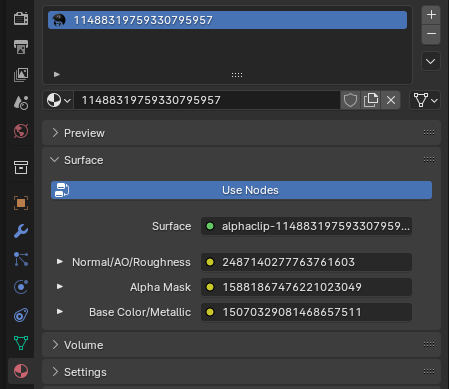

# Alpha Clip
Comes with 3 nodes that will you need to replace.

### Node 1: Normal/AO/Roughness (RGBA)
	R - Normal Map Red channel
	G - Normal Map Green channel
	B - Ambient Occlusion
	A - Roughness

::: info
Making the Ambient Occlusion texture fully white may give better results in game. Using the actual texture seems to darken colors when down on planets.
:::

### Node 2: Alpha Mask
The Alpha Mask is particularly important.

It depicts what part of your model is fully visible and what part is fully transparent. Sadly it is only a grayscale image in black and white as Alpha Clip has no capabilities for partial transparency. 

The White of the mask is visible and the black will be transparent.

### Node 3: Color Texture

## Textures
From left to right, this is what each node would look like:

## In Blender
In Blender this is what the textures look like. Unfold using the arrow on the left and press the folder icon to select your texture.

