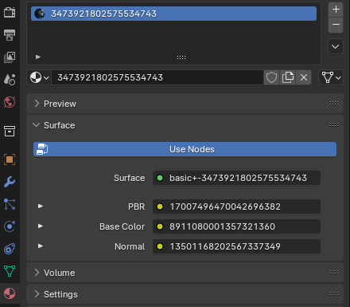

# Basic/Basic+
Comes with 3 nodes that will you need to replace.

### Node 1: PBR Texture (RGBA)
	R - Metallic Texture
	G - Roughness Texture
	B - AO Texture
	A - Fully White

For the Basic Material's AO map, the darker spots are where environmental effects will appear.

> [!IMPORTANT]
> If you are using Basic+, use a fully white image instead of AO for the best results.

### Node 2: Color Texture
### Node 3: Normal Texture

## Textures
From left to right, this is what each node would look like:

## In Blender
In Blender this is what the textures look like. Unfold using the arrow on the left and press the folder icon to select your texture.

