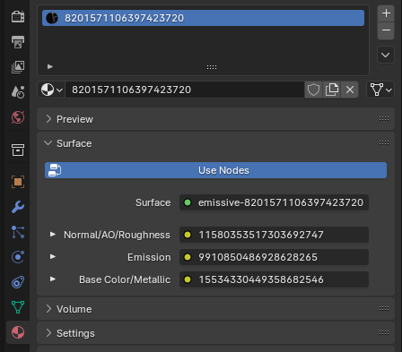

# Emissive
Comes with 3 nodes that will you need to replace.

### Node 1: Normal Texture

### Node 2: Emissive Texture

### Node 3: Color Texture

## Textures
From left to right, this is what each node would look like:

## In Blender
In Blender this is what the textures look like. Unfold using the arrow on the left and press the folder icon to select your texture.

