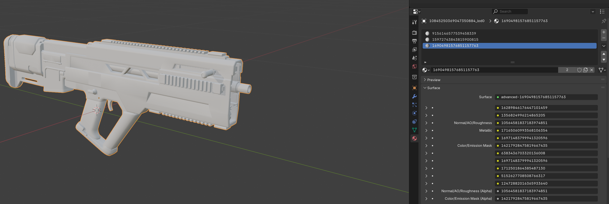

# Extra Material

Some object `LODs` can have an extra material attached to it without instantly crashing the game. This is exclusive in use to weapons and props.

The only reason why you would use this is for optimization purposes or for adding different `material` types to an object.

Now [remember](./material-slot-order.md), `vertex groups` and `weights` are assigned on a material slot basis. This means that the extra material we have added cannot be assigned to any `bones` except for the `root` bone regardless of whatever `vertex group` it is assgned to.

The `root` bone moves the entire `mesh` so whatever `vertices` are assigned to that extra `material` will still move with the `mesh`, it just will not have the ability to have animations.

This extra `material` can be utilized for parts like weapon attachments. You can also use this extra `material` instead of having to create a larger `texture atlas` that may waste space.

## Testing if an Extra Material can be added

The first thing you want to do is test if the object you want to replace can have an extra material in the first place.

[Apply](./overview) any `material` from the SDK and add it to the object you want to test. 

For this example we are adding an extra material to the Liberator. The Liberator usually only has 2 `materials`.

If the game launches and you did not crash, it means that this specific object can have an extra material. We did not crash when adding an extra material to the Liberator.