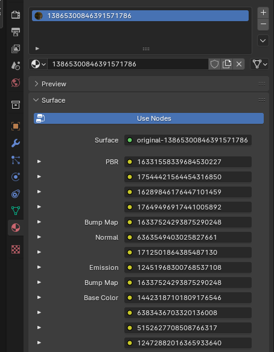

# Original
Comes with 13 textures of which 6 you will need to replace.

### Node 1 : PBR Texture (RGBA)
	R - Sub-Surface Scattering (Use Black Image)
	G - Roughness Texture
	B - Ambient Occlusion
	A - Use a full white grayscale map or fully opaque

::: info
For the Sub-Surface Scattering, use a black grayscale map.
:::

### Node 5 : Bump Map
This is technically a micro-normal texture but for our purposes we will just replace this with a blank normal texture.

### Node 6 : Normal Texture

### Node 8 : Emissive Texture
If you do not have an emissive use a blank PNG instead.

### Node 9 : Bump Map
Same as Node 5, replace with a blank normal texture.

### Node 10 : Color texture for your model

### Other Nodes: (2, 3, 4, 7, 11, 12, 13)
Fill with a blank png. Using a 128 x 128 pixel empty png gives the best results. Using textures with a lower resolution than 128px has been seen to cause issues.

## Textures
From left to right, this is what each node would look like:

## In Blender
In Blender this is what the textures look like. Unfold using the arrow on the left and press the folder icon to select your texture.

