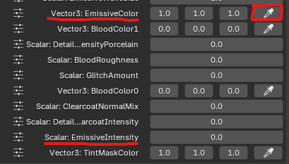

# Translucent
Comes with a single node you do not need to replace. 

### Node 1: Normal Texture
It is a 1x1 pixel normal map that does not affect anything even when replaced.

## Parameters
You are able to change the color, opacity and roughness of your material through the material editor.

Click on the box icon on your Advanced Material ID to fold-out the menu.

### Scalar: OpacityBase 
0 is completely see-through while 1 is about as opaque as plexiglass. 1 will never be completely solid.

### Scalar: RoughnessBase 
0 is completely glossy while 1 is completely rough.

### Vector3: BaseColor 
The color of the transparent glass.

> [!IMPORTANT]
> Once you are done setting your parameters, make sure you save your material before patching. These parameters must be set each time you create (not write) a new patch so be sure to write down what parameters you used for future reference.

## Textures
From left to right, this is what each node would look like:

## In Blender
In Blender this is what the textures look like. Unfold using the arrow on the left and press the folder icon to select your texture.

