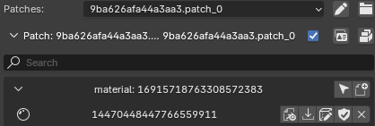

# Functions

## SDK Functions

These are functions used through the SDK Modding Menu.

### Discord

A direct link to the HD2 Community Modding Discord.

### Archive IDs

A direct link to the spreadsheet listing the archives for currently found game assets.

### GitHub SDK Link

### Star Icon

Loads the base game archive `9ba626afa44a3aa3` into the SDK.

### Search Found Archives

Find and load the archive for the object input into the search bar.

### Unload Patches

Unloads all patches currently loaded in the SDK, including the `base archive`.

### Archives

Foldout menu displaying all archives currently loaded in the SDK.

### Manually Load Archives

Search the `data` folder for an archive to load into the SDK.

### New Patch

Makes a new patch in the SDK. Will automatically load the `base archive` if it has not been loaded yet.

### Create Patch

Creates a patch set in the `data` folder from the current modified objects in the SDK.

### Export Patch

Exports the patch set to a specified location as a `.zip` file.

### Unload Patches

Unloads all patch sets currently loaded in the SDK.

### Rename Mod

Renames current patch set. Obsolete Feature.

### Manually Load Patch

Loads patch set into the SDK.

### Currently Modifed Objects Checkmark

Displays all modified objects in the current patch and hides all other objects.

### Save

Saves selected object into the current patch set.

### Import

Imports selected object into the Blender scene.

### Add to Patch

Adds selected object to patch

### Remove from Patch

Clicking the shield icon will undo modifications to selected object, while clicking the X icon will remove the object from the patch entirely.

::: info
The X icon will only appear if the `Currently Modifed Objects Checkmark` is selected or if a different archive from the modified object is selected.
:::

### Show Material Editor

Displays the shader options for the selected material.

## Right Click Functions

These are functions used when right clicking an object in the SDK or in the Blender scene.

### Right Click Mesh

    Copy HexID - Copies the HexID of the selected object
    Copy ID - Copies the Numerical ID of the selected object
    Copy HD2 Properties - Copies all the HD2 properties attached to the selected object
    Paste HD2 Properties - Pasted previously copied HD2 properties to the selected object
    Save Meshes - Saves selected objects to current patch

### Right Click Object in SDK Menu

    Copy Entry - Copies selected entry's name
    Duplicate Entry - Duplicates select entry and pastes it into current patch
    Add to Patch - Adds selected entry into current patch
    Import - Imports selected entry into Blender scene
    Import Object Dump - Imports object dump from user selected files
    Export Object Dump - Exports object dump to user specified location
    Save - Saves select entry into current patch
    Copy Entry ID - Copy selected entry numerical ID
    Copy Hex ID - Copy selected entry HexID
    Copy Type ID - Copy selected entry Type ID IE: Material, texture, mesh, ECT.
    Copy Friendly Name - Copy select entry internal name if applicable IE: assault_rifle
    Set Friendly Name - Manually set name of entry