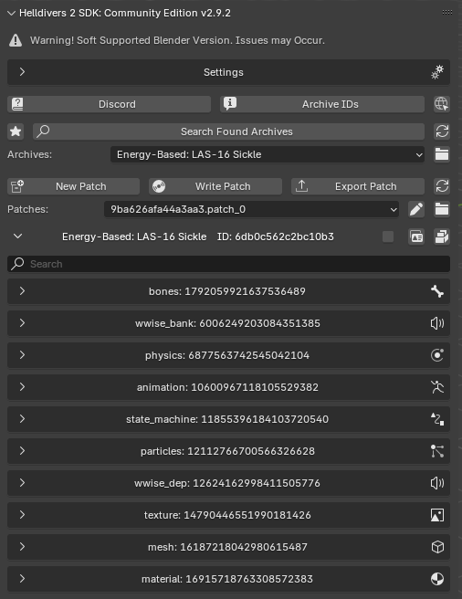
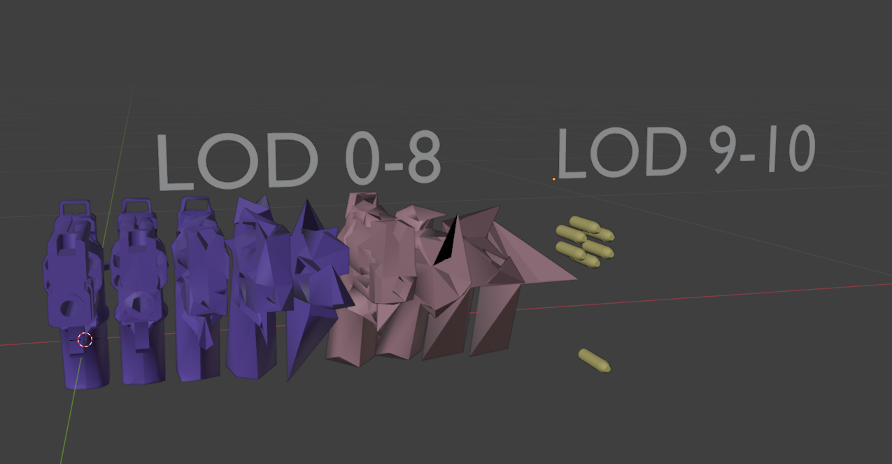
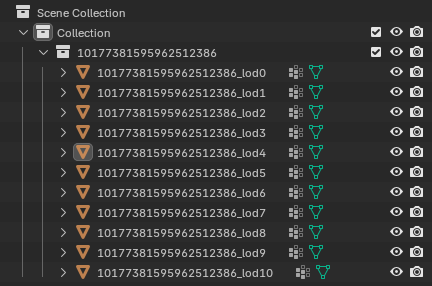
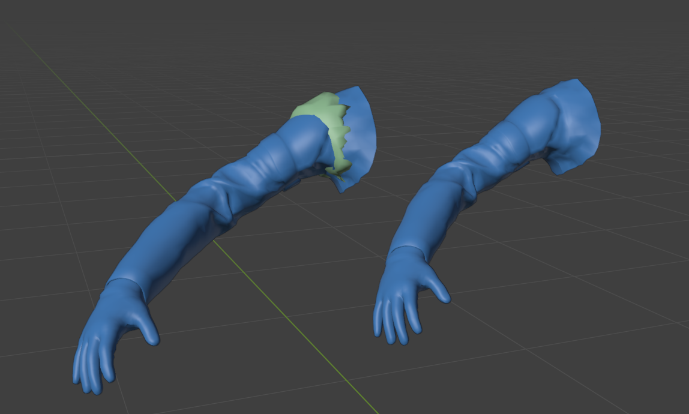
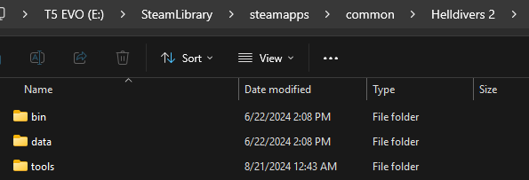

# Settings

## Display Types

### Extra Entry Types

The SDK normally only displays `texture`, `mesh`, and `material`.

This setting will display additional resources such as `particles` and `bones`.

Useful for modders looking to change functions outside of model replacements.

### Show Friendly Names

Displays internal name of an item instead of numeric ID.

## Import Options

### Import Materials

Attaches `materials` to imported `meshs`

::: info Important
This is enabled by default and should remain enabled
:::

### Import LODs

Imports all LODs `Level of Detail` of the `mesh`. `LOD 0` being the highest quality and `LOD ~8` being the lowest quality.

Most of the time you will not need to use this setting, however, some game `mesh`s have different functions in different LODs.

An example of this is the Senator Pistol. 

`LOD 0` through `LOD 8` are the Senator LODs, while `LOD 9` and `LOD 10` are the reloading bullet LODs.

In order to properly change the Senator you will need to mod each of the LODs.

### Import Group 0 Only

Imports only `LOD0` of the `mesh`

### Make Collections

Each imported `mesh` ID will be imported with it's own collection in Blender

### Import Culling Bounds

Imports the bounds of an `mesh` where if any part of the game screen can see it, the game will render it.

::: warning
Currently only works for a handful of `meshes` and is an incomplete feature
:::

### Import Static Meshes

Imports the static meshes of the `mesh`. Some `mesh`s do not have any LODs and only static meshes.

There are some key differences between `LODs` and `Static Meshes` in HD2.

`LODs` will have a set amount of `materials` and will have specific `vertex groups` assigned to the `armature`.

`Static Meshes` can have an unlimited amount of `materials` and will be assigned to the `root bone` of any given `armature`.

### Remove Gore Meshes

Will remove the gore `meshes` from any imported HD2 armor sets.

::: info
At this current time, any modded armor that changes the mesh in any way will break the base game gibs. It is highly recommended to leave this setting on for newer modders as it will reduce the amount of headaches during the modding process.
:::

## Export Options

### Force 3 UV Sets

Will duplicate the first `UVMap` of the saved `mesh` to the second and third `UVMaps`.

HD2 uses different UVMaps for different functions. This is only important if you plan on making a `LUT` based mod.

`UVMap` is the standard mapping of the textures onto the `mesh`

`UVMap.001` is the gore size scalar

`UVMap.002` is the decal `texture atlas` mapping

::: warning
If this setting is turned off and your `mesh` only has a single `UVMap`, the `mesh` will appear invisible in-game.
:::

### Force 1 Group

Forces the saved `mesh` to only have one `vertex group`.

This means that instead of having multiple vertex groups like `0_0` and `1_0`, only `0_0` will be saved and the redundant `1_0` is ignored.

::: info
`Vertex Groups` beyond the `vertex group` `0_#` have not been explored extensively. Currently we do not know what the purpose `vertex group` `1_#` or `2_#` serve and discarding them during the exporting process has no visible detrimental effects.
:::

### Auto LODs

Takes the saved `mesh` and applies it to all `LODs` of the saved `mesh` ID.

If you are modding an item that requires you to modify each individual `LOD` of the `mesh`, turn this setting off.

## Other Options

### Save Non-SDK Materials

Saves any base game `material` into your `patch file` if it is currently applied to mesh.

This is useful for when you want to mod a base game `asset` to another `mesh`.

### Save Unsaved on Write

Redundancy function keep enabled.

### Autosave Mesh Materials

Any `materials` and `textures` that are applied to the `mesh` upon saving the `mesh` will automatically be saved to the `patch file`.

If you plan on having separate `patch files` for `textures` and `meshes` this is the function that would streamline your workflow.

### Patch Base Archive Only

Automatically makes and `patch file` write to archive `9ba626afa44a3aa3`.

There is no real reason to turn this off so keep enabled.

### Data Location

Set the location of the HD2 Data folder in order to properly create patches for the game.

You can easily get to this location from the Steam Menu.

    Find Helldivers 2 in your Steam Library
    Right Click
    Properties
    Installed Files
    Size of Installation: # GB on XXX Drive (Browse)