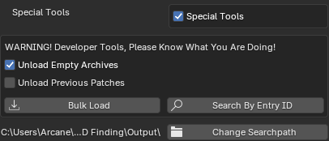
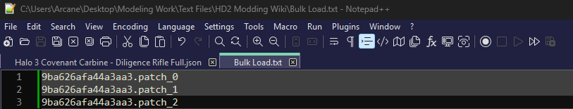
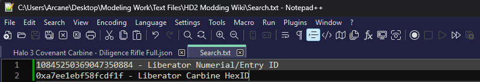
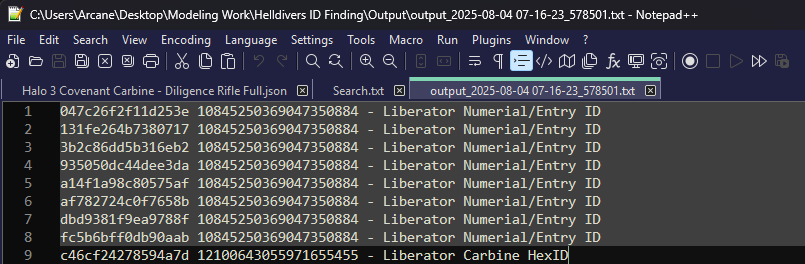

# Special Tools

This section is primarily used for modders to find archives.

If you have the numerical ID or the HexID of a object, you can use this tooling to find the archive that it exists in.

### Unload Empty Archives

Ignores any archives that do not have any `textures`, `meshes`, and `materials`.

### Unload Previous Patches

When using the `Bulk Load` feature, will unload all previous patches created within the SDK.

### Bulk Load

Loads all `patch files` listed in the `.txt` file into the SDK.

::: warning
`Patch Files` must be inside the data folder in order for this to work.
:::

### Search by Entry ID

Finds the archive of the listed numerical ID or HexID of the `.txt` file.

Set your output path first by clicking on `Charge Searchpath`. 

Put all numerical IDs and HexIDs of the objects you want to find the archives for into a .txt file.

Click on `Search by Entry ID` and navigate to the location of your `.txt` file.

Navigate to your output folder and listed inside that `.txt` file will have all the archives where the object is found listed in the first column.

