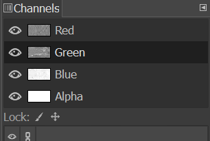
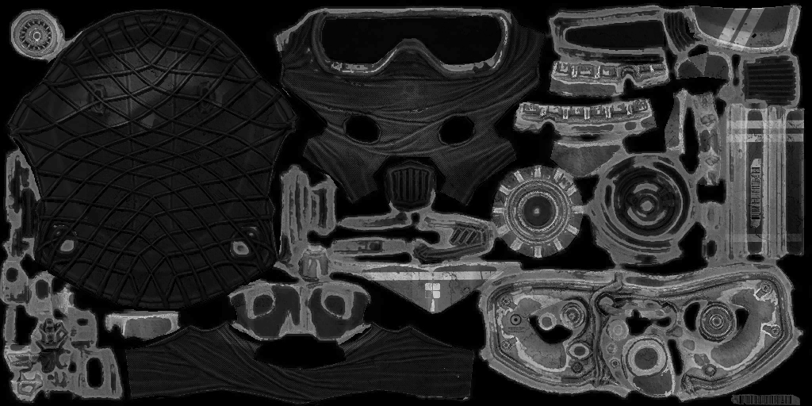

# Textures

The first thing we want to go over is textures. Let’s talk texture types and what each type corresponds to. There are also two types of texture formats. 

::: warning IMPORTANT
All textures must be a <u>**square image**</u> with a <u>**power of 2 resolution**</u> or else they will cause issues in the game. (512px, 1024px, 2048px, 4096px, etc.)
:::

If you do not want to read, you can watch this video instead for an explanation on what textures are.

<iframe src="https://www.youtube.com/embed/53Rdzthjuu0" title="Textures Video" frameborder="0" allowfullscreen></iframe>

## Texture Formats

### RGBA 
4 channel image consisting of Red, Green, Blue, and Alpha channels.

RGB is just the color of the texture while Alpha is the total transparency of the texture from a value of 0 to 255. 0 is fully transparent while 255 is fully opaque.

### Grayscale
Single channel image with values from black to white.

Texture that values from 0 to 255 where 0 is fully black and 255 is fully white. They _can_ still have 4 channels like the RGBA texture but there is no presence of color as all channels will be exactly the same.

## Texture Types

### Base Color 
RGBA texture that is the framework for your model. It’s what the model should look like color wise.

### Normal 
RGBA texture that gives detail to your model. It’s what takes a flat plane and gives it bumps and ridges.

::: info
There are two types of normal maps, OpenGL and DirectX. The difference between them are how the Green channel is interpreted. In this aspect, OpenGL and DirectX are inverse of each other.

The top example is an OpenGL normal texture, while the bottom example is a DirectX normal texture.

It is <u>**imperative**</u> that your normal map is in <u>**OpenGL format**</u> as that is what HD2 uses.

If you need to change your normal map from OpenGL to DirectX, or vice versa, there is a simple way to do so using GIMP.

1. Have only the green channel selected
2. Go to `Colors > Invert`

:::

### Emissive 
RGBA texture that determines what parts of a model glows and with how much strength. RGB determines the color, while A determines the strength where 0 is none and 255 is full.

::: info
This specific emissive uses is a gray-scale texture, meaning the color is determined by the interal game engine parametes. Emissives can come in either RGBA or gray-scale format.
:::

### Metallic 
Lighting grayscale texture that determines how much luster a model surface has. Goes from a value of 0 (Black) no metallic to 255 (White) full metallic. Used in conjunction with Roughness.

### Roughness 
Lighting grayscale texture that determines how much light reflects off a model surface. More roughness is less light reflection. Goes from a value of 0 (Black) no roughness to 255 (White) full roughness. Used in conjunction with Metallic.

::: info
Sometimes roughness textures are called gloss textures. Roughness and gloss are inverse of each other, so the easiest way to get a roughness texture from gloss is to just invert colors in GIMP.
:::

::: info
You can get fully metallic, stained metal, shiny plastic, or plastic type looks when using metallic and roughness together.

:::

### Ambient Occlusion 
Also known as AO. Lighting grayscale texture that determines how much artificial shadow will be drawn upon a model. More AO is lower saturation in those areas (color becomes black). Goes from a value of 0 (Black) Full Shadows to 255 (White) No Shadows. Use it if your model comes with it, but a full white AO texture is fine as well.

### Physically Based Rendering 
Also known as PBR. This is a RGBA texture that combines multiple lighting textures together into a single texture. This is used to optimize on game space and is used for our models to get the correct lighting for models when importing into HD2. Depending on what HD2 shader preset you use there will be different PBRs used. This example uses the “Basic Shader” preset.

