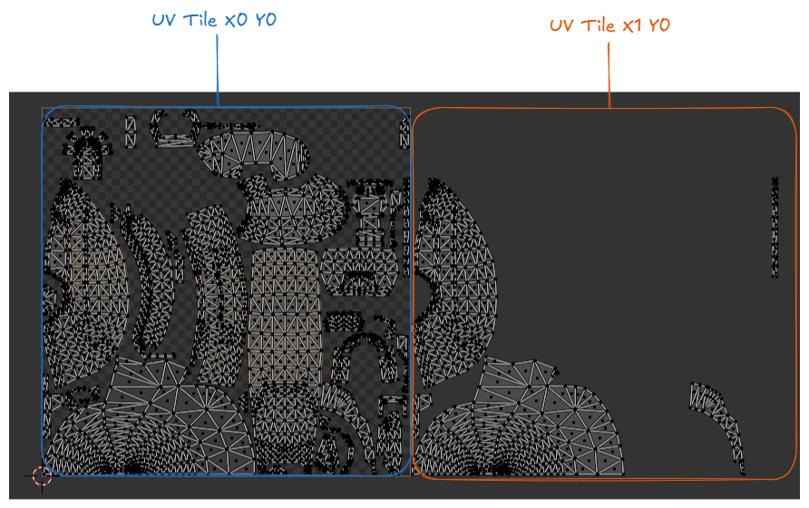
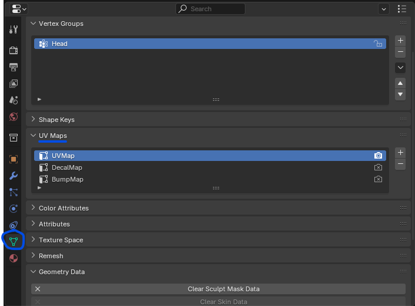
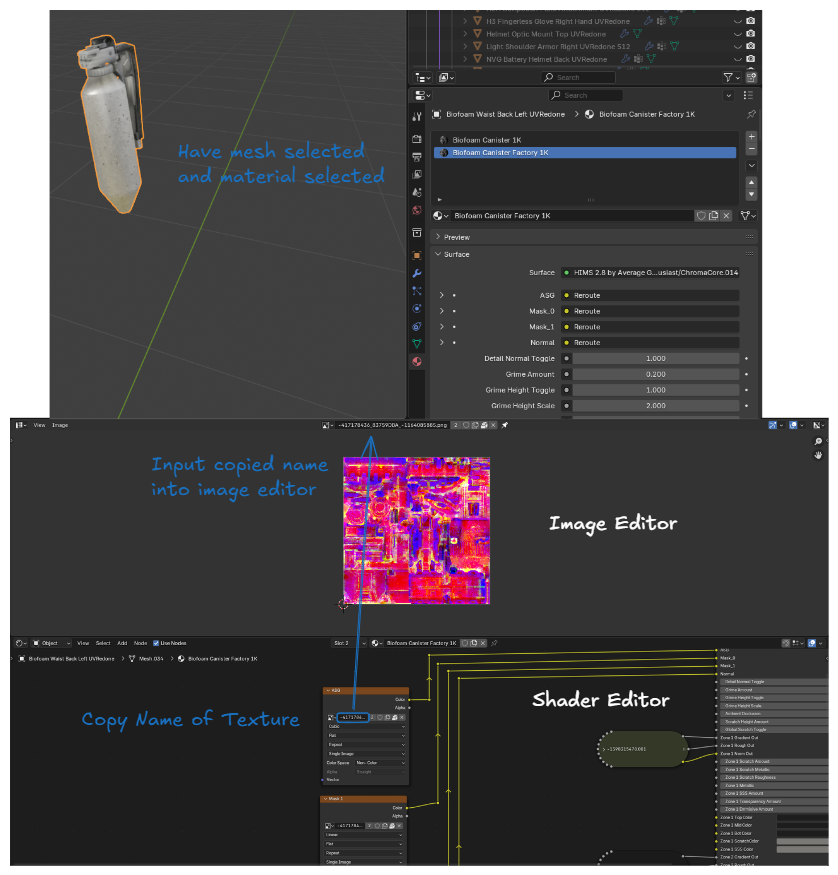

# Texture Baking

This section will go over how to bakes textures into a usable format for HD2 modding. This is mainly for textures that come from games like Halo or HD2 itself where conventional texture formats are not used.

## Blender Baking

<iframe src="https://www.youtube.com/embed/Se8GdHptD4A" title="Blender Baking" frameborder="0" allowfullscreen></iframe>

## Principled Baker

<iframe src="https://www.youtube.com/embed/cw6o_Cvv6UQ" title="Principled Baker" frameborder="0" allowfullscreen></iframe>

## Simple Baker

<iframe src="https://www.youtube.com/embed/R-w0LFgebKs" title="Simple Bake" frameborder="0" allowfullscreen></iframe>

## Common Issues

### UVMap

Ensure you have the correct `UVMap` selected and that the UVMap is tiled to tile0.

### Packed Textures

If the `textures` do not bake properly still, ensure that the .blend file you have has access to the original textures. If said `textures` do not exist, then Blender has nothing to bake from.

If nothing shows up when you put the name of the `texture` into the image editor, it means that .blend file cannot locate the `texture`. You will need to relocate that texture in order for Blender to bake properly.