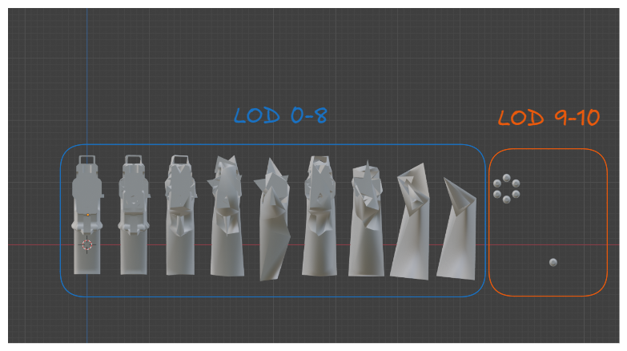
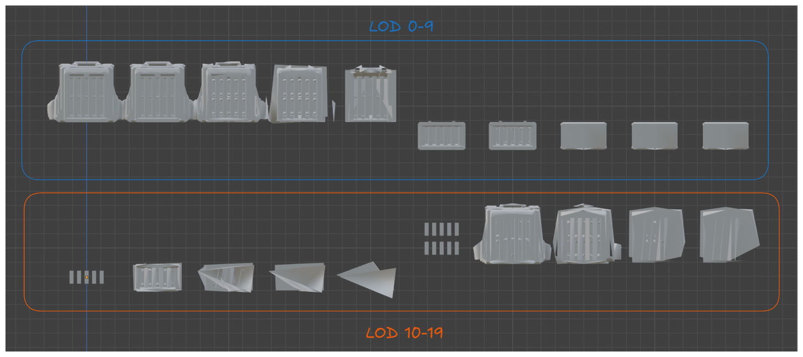
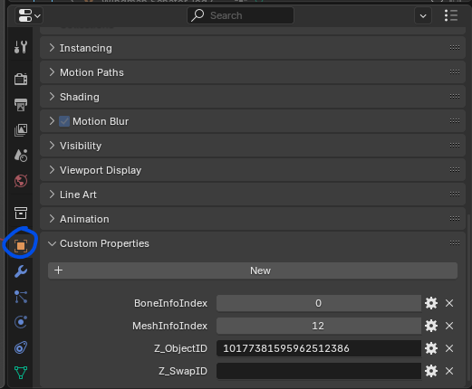
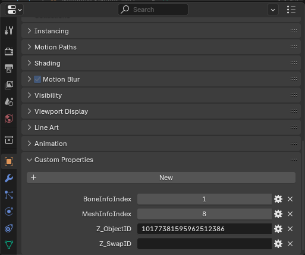
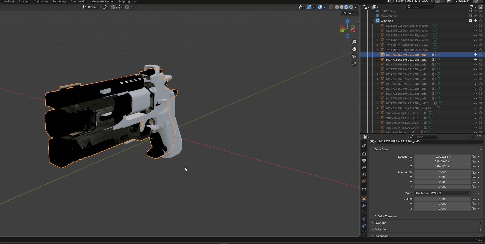
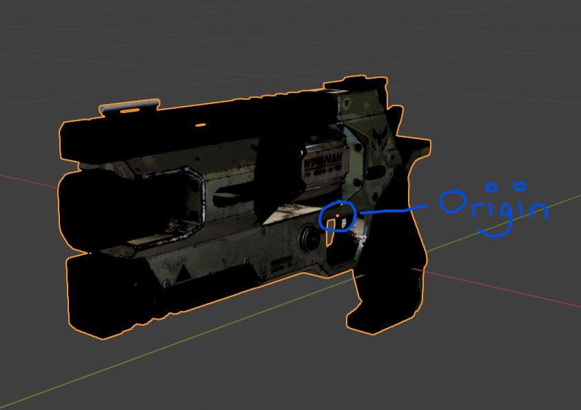

# Weapon/Equipment Replacement (LODs)

Certain `units` in this game will require you to modify all `LODs` of the `unit` in order to properly modify it in-game. Some examples of this are the P-4 Senator Pistol and the AC-8 Autocannon Backpack.

As you can see, the Senator pistol has it's bullets in `LOD 9-10` and the AC-8 Backpack has stripper clips in `LOD 10` and `LOD 15`. If you had the `Auto LODs` setting enabled, the Senator would lose the bullets in-game and the AC-8 Backpack would lose the stripper clips.

## Replacing LODs

To start off with, mod your weapon onto `LOD 0` of the `unit` you are replacing. Refer to the [previous section](weapon-replacement) until you reach this stage.

Once you have done so, you will have two choices:

    Replace all the LODs with the same quality as LOD 0
    Manually decimate `LOD 0` so that each further LOD

The first option takes no time to do, but will have a higher impact on performance if the model you are using has a large amount of vertices, while the second option will have a reduced impact on performance but will take slightly longer to do.

### LOD Replacement Option 1

Replace `LOD 0` of the `unit` you are modifying. Each `LOD` of the `unit` will have a specific `BoneIndexInfo` and `MeshIndexInfo` associated with it. You can view it by clicking on the object in Blender and viewing the object custom properties.

Specifically for the Senator, `LOD 0` is `BoneInfoIndex 0` and `MeshInfoIndex 12`

Here's is what the custom properties look like for Senator `LOD 1`

All you need to do to also replace properly `LOD 1` for the Senator would be to copy the properties of it. Duplicate your `LOD 0` then paste the properties of `LOD 1` onto it.

Repeat this for every `LOD` that needs to get replaced. In this case, you will need to replace `LODs` 0-8 to replace all the Senator gun meshes. You will then modify `LODs` 9 and 10 (Senator Bullets) as needed to work with your modded weapon.

::: warning
Sometimes points of origin change per LOD of a `unit` so make sure to check each `LOD` of the `unit` you are replacing to ensure that your points of origin are the same as the `unit` that is being replaced.

:::

### LOD Replacement Option 2

The steps are the same as before, but this time you will be decimating every subsequent `LOD`. This can either be done using the decimate modifier or by using a [plugin](https://superhivemarket.com/products/lods-maker--create-level-of-details-in-1-click/?ref=165).

When using this method, have `LOD 0` and `LOD 1` be the same quality. `LOD 0` is usually used for first person view, and `LOD 1` is used for third person view.

For `LOD 2` and beyond, being using the decimate modifier. Change the settings to whatever you feel is right. Repeat until all relevant `LODs` are replaced.

